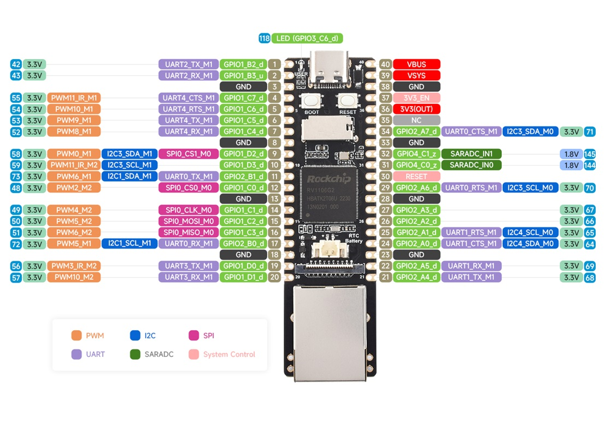

## Дослідження по LuckFox


## Задіяна плата Luckfox Pico Pro (RV1106G2,128MB RAM,256 SPI NAND FLASH)

Також все повинно бути актуально для Luckfox Pico Plus, Luckfox Pico Max, Luckfox Pico Ultra)

Задіяна періферія:




Шо куди підключено:

Функція                          | Пін | HW
---------------------------------|----|-----
+5V (живлення)                   | 40 | VBUS
GND (живлення)                   | 38 | GND
PPM1 (правий борт)               | 15 | PWM5
PPM2 (лівий борт)                | 16 | PWM6
PPM3 (резерв1)                   | 14 | PWM4
PPM4 (резерв2)                   | 12 | PWM2
RF-IN (вхід з приймача) RX       | 20 | UART4_RX
RF-IN (вихід на телеметрію) TX   | 19 | UART4_TX
RF-OUT (вихід на контролер) TX   | 21 | UART1_TX
RF-OUT (вхід телеметрії) RX      | 22 | UART1_RX
OLED (SDA)                       | 24 | I2C4_SDA
OLED (SCL)                       | 25 | I2C4_SCL
BEEPER                           | 26 | GPIO2_A2
IO1 (лебідка вгору)              |  4 | GPIO1_C7
IO2 (лебідка вниз)               |  5 | GPIO1_C6
IO3 ()                           |  6 | GPIO1_C5
IO4                              |  7 | GPIO1_C4
DEBUG_TX (tty)                   |  1 | UART2_TX
DEBUG_RX (tty)                   |  2 | UART2_RX
GND                              |  3 | GND


## Треба перепрошити кастомну збірку

TBD


## Встановлення та запуск

Сподіваюсь це не знадобиться, і все шо треба, буде вже в кастомній збірці.

А поки робимо вручну

```
cd /root
wget -qO- http://s.navi.cc/drone/install.sh | sh
```


## Кастомна збірка

За замовченням, всі uart вимкнені, як і PWM тому робимо по
[інструкції](https://wiki.luckfox.com/Luckfox-Pico/Luckfox-Pico-PWM#5-modify-device-tree):

переконаємось де dts:

<SDK directory>/project/cfg/BoardConfig_IPC/BoardConfig-SPI_NAND-Buildroot-RV1106_Luckfox_Pico_Pro_Max-IPC.mk

(Доречі, може спробуємо прибрати зайве?)
export RK_ENABLE_ROCKCHIP_TEST=n
export RK_ENABLE_WIFI=n

Нас цікавить строчка
RK_KERNEL_DTS=rv1106g-luckfox-pico-pro-max.dts


правимо:

sysdrv/source/kernel/arch/arm/boot/dts/rv1106g-luckfox-pico-pro-max.dts


```
/**********UART**********/
&uart1 {
	status = "okay";
};
/* UART3_M1 */
&uart3 {
	status = "okay";
};

/**** PWM *****/
&pwm2 {
    status = "okay";
    pinctrl-names = "active";
};

&pwm4 {
    status = "okay";
    pinctrl-names = "active";
};

&pwm5 {
    status = "okay";
    pinctrl-names = "active";
    pinctrl-0 = <&pwm5m2_pins>;
};

&pwm6 {
    status = "okay";
    pinctrl-names = "active";
    pinctrl-0 = <&pwm6m2_pins>;
};

```

Требе переконатись шо pwm5 буде саме на пінах GPIO1_C2 (а не на GPIO2_B0 де є I2C1_SCL)
Требе переконатись шо pwm6 буде саме на пінах GPIO1_C3 (а не на GPIO2_B1 де є I2C1_SDA)


Обираємо нашу плату та перезбираємо ядро

```
build.sh lunch
build.sh kernel
```

Шоб все не перезбирати, я скопіював все інше з орігінальної прошиіки в
каталог ./output/image

Та виконав:

```
./build.sh updateimg
```

Далі натискаємо та тримаємо boot, та вставляємо живлення.

```
sudo ../upgrade_tool_v2.25_for_mac/upgrade_tool uf ./update.img
```

Начебто якось можна окремо прошивати boot.img, але я не зміг

https://github.com/xx-7/xpg/blob/e32d4f8a1e0ce4ad418412eb4cfa72816fbfbafa/hw/board/rk/upgrade_tool.md?plain=1#L23


## Додавання кастомних драйверів

Хотів би якось приколхозити нормально OLED, через драйвер

https://github.com/bdcabreran/ssd1306-linux/blob/master/README.md


## Генерація PPM

Генерація на прикладі pwm6 (pin 16)

```
echo 0 > /sys/class/pwm/pwmchip6/export
cd /sys/class/pwm/pwmchip6/pwm0
echo "20000000" > period && echo "1500000" > duty_cycle && echo "normal" > polarity && echo 1 > enable
```


## Далі може бути неактуальне, то було ще на версії без Ethernet

В мене версія без Ethernet. При спробі підключити зовнішній USB-Ethernet адаптер,
зрозумів шо USB-Host відключен.

https://wiki.luckfox.com/Luckfox-Pico/Luckfox-Pico-USB

І треба правити dts шоб його увімкнути, і, напевно
перепрошивати плату.

Пробуємо свою прошивку https://wiki.luckfox.com/Luckfox-Pico/Linux-MacOS-Burn-Image

Дозволити на MacOS виконання утіліти оновлення прошивки.

```
xattr -dr com.apple.quarantine ./upgrade_tool
```

sudo ../upgrade_tool_v2.25_for_mac/upgrade_tool uf update.img

## Пробуємо зібрати SDK

Будемо пробувати на Ubuntu Linux

https://wiki.luckfox.com/Luckfox-Pico/Luckfox-Pico-SDK/


libffi в buildroot відмовився збиратись

Не знаю як краще, вручну пофіксив
sysdrv/source/buildroot/buildroot-2023.02.6/package/libffi/libffi.mk

```
LIBFFI_VERSION = 3.4.6
``

та
sysdrv/source/buildroot/buildroot-2023.02.6/package/libffi/libffi.hash

```
sha256  b0dea9df23c863a7a50e825440f3ebffabd65df1497108e5d437747843895a4e  libffi-3.4.6.tar.gz
```


Можливо це якось можна зробити підсунувши свій `BUILDROOT_VER` у `sysdrv/Makefile`


Хоча ось шо знайшов:

https://github.com/mingzhangqun/luckfox-pico/commit/050175246d74a27ad4edc683c140fc89afa97996


Пробуємо правити dts

<SDK directory>/sysdrv/source/kernel/arch/arm/boot/dts/rv1103g-luckfox-pico-mini-b.dts

Переключаємо USB у HOST-режим

sysdrv/source/kernel/arch/arm/boot/dts/rv1103g-luckfox-pico-mini.dts
```
/**********USB**********/
&usbdrd_dwc3 {
	status = "okay";
	dr_mode = "peripheral";
	dr_mode = "host";
};
```


## Спроба PPM

Я експереметував на LuckFox Pico Mini A/B:

PWM10_1 - Pin 54
PWM11_1 - Pin 55

Але одразу затик:

```
ls -l /sys/class/pwm
```

Показує шо немає нічого
