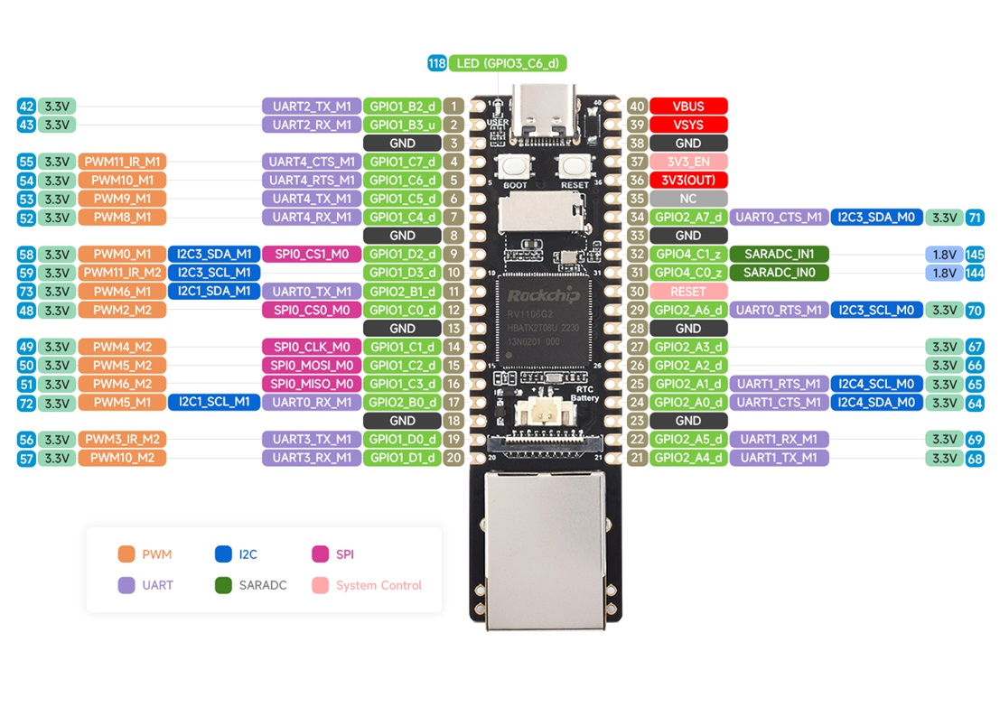

## Дослідження по LuckFox


## Задіяна плата Luckfox Pico Pro (RV1106G2,128MB RAM,256 SPI NAND FLASH)

Також все повинно бути актуально для Luckfox Pico Plus, Luckfox Pico Max, Luckfox Pico Ultra)

Задіяна періферія:




Шо куди підключено:

Функція                          | Пін | HW
---------------------------------|----|-----
+5V (живлення)                   | 40 | VBUS
GND (живлення)                   | 38 | GND
PPM1 (правий борт)               | 15 | PWM5
PPM2 (лівий борт)                | 16 | PWM6
PPM3 (резерв1)                   | 14 | PWM4
PPM4 (резерв2)                   | 12 | PWM2
RF-IN (вхід з приймача) RX       | 20 | UART3_RX
RF-IN (вихід на телеметрію) TX   | 19 | UART3_TX
RF-OUT (вихід на контролер) TX   | 21 | UART1_TX
RF-OUT (вхід телеметрії) RX      | 22 | UART1_RX
OLED (SDA)                       | 34 | I2C3_SDA
OLED (SCL)                       | 29 | I2C3_SCL
BEEPER                           | 26 | GPIO2_A2
OLED (VDD)                       | 27 | GPIO2_A3
IO1 (лебідка вгору)              |  4 | GPIO1_C7
IO2 (лебідка вниз)               |  5 | GPIO1_C6
IO3 ()                           |  6 | GPIO1_C5
IO4                              |  7 | GPIO1_C4
DEBUG_TX (tty)                   |  1 | UART2_TX
DEBUG_RX (tty)                   |  2 | UART2_RX
GND                              |  3 | GND


## Треба перепрошити кастомну збірку

1. Встановіть [ПО для прошивки](https://files.luckfox.com/wiki/Luckfox-Pico/Software/SocToolKit.zip)
2. Заванжажте файли прошивки з цього репозиторію, з теки `luckfox/luckfox-pico-pro`.
3. Інструкція по прошивці є [тут](https://wiki.luckfox.com/Luckfox-Pico/Luckfox-Pico-Flash-burn-image)


## Встановлення та запуск

Сподіваюсь це не знадобиться, і все шо треба, буде вже в кастомній збірці.

А поки робимо вручну. Заходимо на плату через DEBUG UART, авторизуємося під `root`, пароль `luckfox`.
Виконуємо:

```
cd /root
wget -qO- http://s.navi.cc/drone/install.sh | sh
```


## Кастомна збірка

За замовченням, всі uart вимкнені, як і PWM тому робимо по
[інструкції](https://wiki.luckfox.com/Luckfox-Pico/Luckfox-Pico-PWM#5-modify-device-tree):

переконаємось де dts:

<SDK directory>/project/cfg/BoardConfig_IPC/BoardConfig-SPI_NAND-Buildroot-RV1106_Luckfox_Pico_Pro_Max-IPC.mk

(Доречі, може спробуємо прибрати зайве?)
export RK_ENABLE_ROCKCHIP_TEST=n
export RK_ENABLE_WIFI=n

Нас цікавить строчка
RK_KERNEL_DTS=rv1106g-luckfox-pico-pro-max.dts


правимо:

sysdrv/source/kernel/arch/arm/boot/dts/rv1106g-luckfox-pico-pro-max.dts


```
/**********UART**********/
&uart1 {
	status = "okay";
};
/* UART3_M1 */
&uart3 {
	status = "okay";
};

/**** PWM *****/
&pwm2 {
    status = "okay";
    pinctrl-names = "active";
};

&pwm4 {
    status = "okay";
    pinctrl-names = "active";
};

&pwm5 {
    status = "okay";
    pinctrl-names = "active";
    pinctrl-0 = <&pwm5m2_pins>;
};

&pwm6 {
    status = "okay";
    pinctrl-names = "active";
    pinctrl-0 = <&pwm6m2_pins>;
};

```

Требе переконатись шо pwm5 буде саме на пінах GPIO1_C2 (а не на GPIO2_B0 де є I2C1_SCL)
Требе переконатись шо pwm6 буде саме на пінах GPIO1_C3 (а не на GPIO2_B1 де є I2C1_SDA)


Обираємо нашу плату та перезбираємо ядро

```
build.sh lunch
build.sh kernel
```

Шоб все не перезбирати, я скопіював все інше з орігінальної прошиіки в
каталог ./output/image

Та виконав:

```
./build.sh updateimg
```

Далі натискаємо та тримаємо boot, та вставляємо живлення.

```
sudo ../upgrade_tool_v2.25_for_mac/upgrade_tool uf ./update.img
```

В Linux можна просто через (якшо не забули виконати `./build.sh updateimg`)

```
sudo ./rkflash.sh update
```

Начебто якось можна окремо прошивати boot.img, але я не зміг

https://github.com/xx-7/xpg/blob/e32d4f8a1e0ce4ad418412eb4cfa72816fbfbafa/hw/board/rk/upgrade_tool.md?plain=1#L23


## Додавання кастомних драйверів

Хотів би якось приколхозити нормально OLED, через драйвер

https://github.com/bdcabreran/ssd1306-linux/blob/master/README.md


## Генерація PPM

Генерація на прикладі pwm6 (pin 16)

```
echo 0 > /sys/class/pwm/pwmchip6/export
cd /sys/class/pwm/pwmchip6/pwm0
echo "20000000" > period && echo "1500000" > duty_cycle && echo "normal" > polarity && echo 1 > enable
```


## Далі може бути неактуальне, то було ще на версії без Ethernet

В мене версія без Ethernet. При спробі підключити зовнішній USB-Ethernet адаптер,
зрозумів шо USB-Host відключен.

https://wiki.luckfox.com/Luckfox-Pico/Luckfox-Pico-USB

І треба правити dts шоб його увімкнути, і, напевно
перепрошивати плату.

Пробуємо свою прошивку https://wiki.luckfox.com/Luckfox-Pico/Linux-MacOS-Burn-Image

Дозволити на MacOS виконання утіліти оновлення прошивки.

```
xattr -dr com.apple.quarantine ./upgrade_tool
```

sudo ../upgrade_tool_v2.25_for_mac/upgrade_tool uf update.img

## Пробуємо зібрати SDK

Будемо пробувати на Ubuntu Linux

https://wiki.luckfox.com/Luckfox-Pico/Luckfox-Pico-SDK/


libffi в buildroot відмовився збиратись

Не знаю як краще, вручну пофіксив
sysdrv/source/buildroot/buildroot-2023.02.6/package/libffi/libffi.mk

```
LIBFFI_VERSION = 3.4.6
``

та
sysdrv/source/buildroot/buildroot-2023.02.6/package/libffi/libffi.hash

```
sha256  b0dea9df23c863a7a50e825440f3ebffabd65df1497108e5d437747843895a4e  libffi-3.4.6.tar.gz
```


Можливо це якось можна зробити підсунувши свій `BUILDROOT_VER` у `sysdrv/Makefile`


Хоча ось шо знайшов:

https://github.com/mingzhangqun/luckfox-pico/commit/050175246d74a27ad4edc683c140fc89afa97996


Пробуємо правити dts

<SDK directory>/sysdrv/source/kernel/arch/arm/boot/dts/rv1103g-luckfox-pico-mini-b.dts

Переключаємо USB у HOST-режим

sysdrv/source/kernel/arch/arm/boot/dts/rv1103g-luckfox-pico-mini.dts
```
/**********USB**********/
&usbdrd_dwc3 {
	status = "okay";
	dr_mode = "peripheral";
	dr_mode = "host";
};
```


## Спроба PPM

Я експереметував на LuckFox Pico Mini A/B:

PWM10_1 - Pin 54
PWM11_1 - Pin 55

Але одразу затик:

```
ls -l /sys/class/pwm
```

Показує шо немає нічого


# Спроба налаштувати Wireguard.

Це просто конспектування різних моментів.

Шо ми вмикаємо у ядрі (./build kernelconfig)

Беру за приклад це: https://github.com/Eugeniusz-Gienek/luckfox-pro-max-wireguard-iptables/blob/main/luckfox_rv1106_linux_defconfig

Там насправді дофіга, і чомусь я впевнон шо більшість з цього не треба

Почав вручну вмикати, але ж там їх реально дохріна

Тестую завантаження wireguard

```
[root@luckfox root]# cd /oem/usr/ko
[root@luckfox ko]# insmod libcurve25519-generic.ko
[root@luckfox ko]# insmod poly1305-arm.ko
[root@luckfox ko]# insmod chacha-neon.ko
[root@luckfox ko]# insmod libchacha20poly1305.ko
[root@luckfox ko]# insmod wireguard.ko
[   98.962958] wireguard: Unknown symbol ipv6_mod_enabled (err -2)
insmod: can't insert 'wireguard.ko': unknown symbol in module, or unknown parameter
[   98.963214] wireguard: Unknown symbol ipv6_chk_addr (err -2)
[root@luckfox ko]# [   98.965620] wireguard: Unknown symbol ipv6_mod_enabled (err -2)
[   98.965867] wireguard: Unknown symbol ipv6_chk_addr (err -2)

[root@luckfox ko]#
```

Спочатку було значно більше, так шо шукаємо чого ще не вистачає

Шукаємо де ipv6_chk_addr:

Після збірки CONFIG_IPV6=y (замість модуля), все пройшло.
І сам WIREGUARD тепер дозволяє підключити в ядро (y). Трохи згодом попробую.

Налаштую wireguard

```
cd /etc/wireguard
umask 077; wg genkey | tee privatekey | wg pubkey > publickey
cat privatekey
cat publickey

vi v_navi_cc.conf


[Interface]
PrivateKey = my_private_key
Address = 192.168.69.4/24


[Peer]
# VPN-Server
PublicKey = public_key_from_server
Endpoint = 91.99.231.19:51820
AllowedIPs = 192.168.69.0/24 # Forward all traffic to server

```

Так не спрацювало. Чогось не вистачає в системі, як мінімум команди `stat`

Можна пробувати вручну використати wg:

```
ip link add dev wg0 type wireguard
ip address add 192.168.69.4/24 dev wg0
wg set wg0 \
    private-key /etc/wireguard/privatekey \
    peer pq7TGGVesPPtxaHxvH1GcN9dR9ctnfABz5QZigoyREg= \
    allowed-ips 192.168.69.0/24 \
    endpoint 91.99.231.19:51820
ip link set up dev wg0
ip route add 192.168.69.0/24 dev wg0

```

Замість wg set можна задіяти

```
wg setconf wg0 /etc/wireguard/v_navi_cc.conf
```

Але тоді треба прибрати з конфіга Address, бо на нього ругається.


## Протестуємо відеострім

Через ffplay:

```
ffplay -fflags nobuffer -flags low_delay -rtsp_transport tcp "rtsp://192.168.69.4:554/live/0"
```

Через gstream:

```
gst-launch-1.0 rtspsrc location="rtsp://192.168.69.4:554/live/0" latency=100 ! queue ! rtph264depay ! h264parse ! avdec_h264 ! videoconvert ! videoscale ! video/x-raw,width=640,height=480 ! autovideosink
```

```
gst-launch-1.0 rtspsrc location="rtsp://192.168.69.4:554/live/0" retry=5 timeout=1000000 latency=7 buffer-mode=1 ! decodebin ! videoconvert ! autovideosink sync=false
```

```
gst-launch-1.0 -v \
  rtspsrc location="rtsp://192.168.69.4:554/live/0" \
  protocols=udp latency=0 timeout=5000000 retry=2 do-rtsp-keep-alive=true udp-buffer-size=131072 \
  ! rtph265depay ! h265parse config-interval=-1 \
  ! queue max-size-buffers=1 max-size-bytes=0 max-size-time=0 leaky=downstream
```


Також працює через go2rtc go2rtc.yaml:

```
streams:
  luckfox: rtsp://192.168.69.4/live/0

rtmp:
  listen: ":1935"
```

Відриваємо localhost:1984 і перевіряємо


Швидкий тест з програмним (скоріш за все) кодуванням JPEG:

На Luckfox

'''
gst-launch-1.0 -v v4l2src device=/dev/video11 ! \
    video/x-raw,width=640,height=480 ! \
    jpegenc ! \
    rtpjpegpay ! \
    udpsink host=192.168.3.98 port=5000
'''

На машині оператора:

'''
gst-launch-1.0 -v udpsrc port=5000 ! \
    application/x-rtp, media=video, clock-rate=90000, encoding-name=JPEG, payload=26 ! \
    rtpjpegdepay ! \
    jpegdec ! \
    autovideosink
'''


З H264/265 поки все не дуже.

'''
gst-launch-1.0 -v v4l2src device=/dev/video11 io-mode=4 ! \
    video/x-raw,format=NV12,width=1920,height=1080,framerate=30/1 ! \
    mpph264enc ! \
    h264parse ! \
    rtph264pay config-interval=1 pt=96 ! \
    udpsink host=192.168.3.98 port=5000
'''


Шось поки нічого не виходить із gstreamer на LuckFox. Може ще спробую через rkipc.
Треба зрозуміти, чи може він віддавати rtsp через UDP.

```
gst-launch-1.0 -v rtspsrc location=rtsp://192.168.3.117:554/live/0 latency=0 protocols=udp-mcast+udp ! \
    rtph264depay ! \
    h264parse ! \
    vtdec ! \
    autovideosink sync=false
```