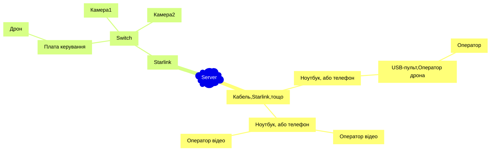

# startlink

Система керування дронами через Starlink.

## Загальна стуктура

Попередньо стукрута може виглядати так:




## Перелік обладнання

* Starlink Mini
* Комутатор локальної мережі (не роутор). Будь який. [TP-Link LS1005G](https://comfy.ua/ua/kommutator-lokal-noj-seti-switch-tp-link-ls1005g.html), 515 грн
* IP-камера (з підключенням через Ethernet) [TP-Link Tapo C520WS](https://comfy.ua/ua/ip-kamera-tp-link-tapo-c520ws.html), 2999 грн
* Контролер керування [Luckfox Pico Pro 128Mb Ethernet](https://rozetka.com.ua/ua/499434449/p499434449/), 565 грн.
* Єкран для діагностики.
* Живлення для всіх компонентів.

## Сервер

Для експеріменту був піднят хмарний сервер.

IPv4: 91.99.231.19
IPv6: 2a01:4f8:1c1a:8b19::/64

Привʼязане доменне імʼя: s.navi.cc


```sh
 uv venv
 source .venv/bin/activate
 uv pip install websockets
```

## Керування

Примітки про пульту TX12

Подивлюсь чи бачить його Chrome.

1	0	0x1209	0x4F54	OpenTX	Radiomaster TX12 Joystick	00000000001B

Оце от бачить джойстік: https://hardwaretester.com/gamepad


PPM1 - левьій борт (v-h)
PPM2 - правьій борт (v+h)
IO1 - лебедка вверх
IO2 - лебедка вниз
IO3 - акту


## Керування камерою

Ми задіяли в прототипі TP-Link Tapo C520WS

Ось шо є цікаве по tp-link

https://dev.to/ad1s0n/reverse-engineering-tp-link-tapos-rest-api-part-1-4g6
