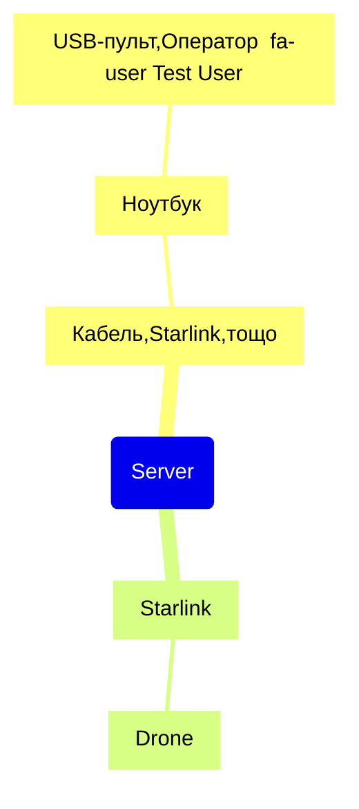

# startlink

Система керування дронами через Starlink.

## Загальна стуктура

Попередньо стукрута може виглядати так:

Пульт керування підключа

```mermaid
mindmap
Root(Server)
    S[Кабель,Starlink,тощо]
        N[Ноутбук]
            O[USB-пульт,Оператор fa:fa-solid fa-user Test User]
    S[Starlink]
        D[Drone]
```

##