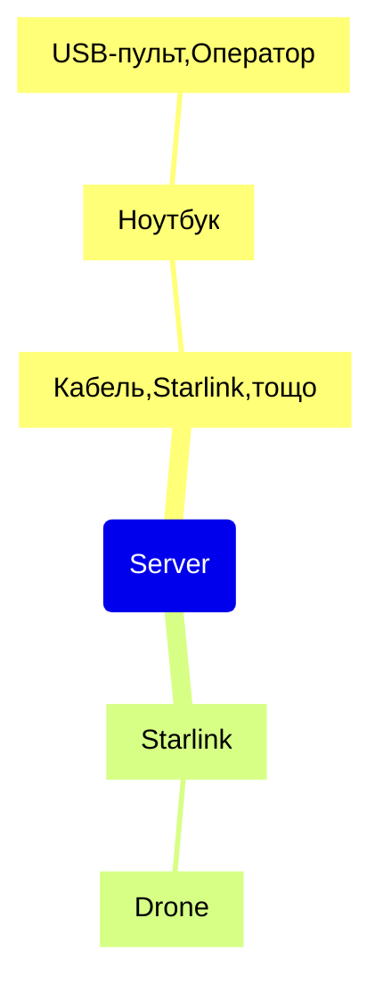

# startlink

Система керування дронами через Starlink.

## Загальна стуктура

Попередньо стукрута може виглядати так:




## Сервер

Для експеріменту був піднят хмарний сервер.

IPv4: 91.99.231.19
IPv6: 2a01:4f8:1c1a:8b19::/64

Привʼязане доменне імʼя: s.navi.cc


```sh
 uv venv
 source .venv/bin/activate
 uv pip install websockets
```

## Керування

Примітки про пульту TX12

Подивлюсь чи бачить його Chrome.

1	0	0x1209	0x4F54	OpenTX	Radiomaster TX12 Joystick	00000000001B

Оце от бачить джойстік: https://hardwaretester.com/gamepad
